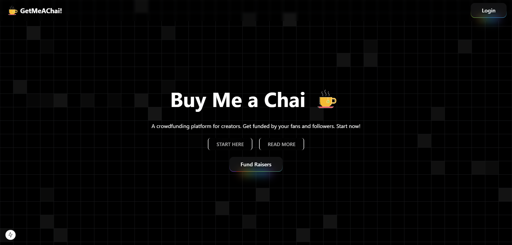
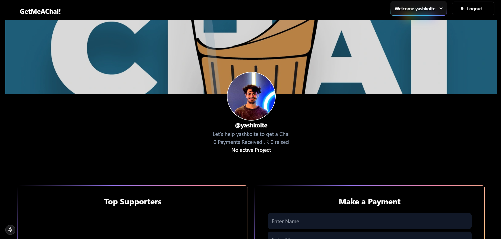
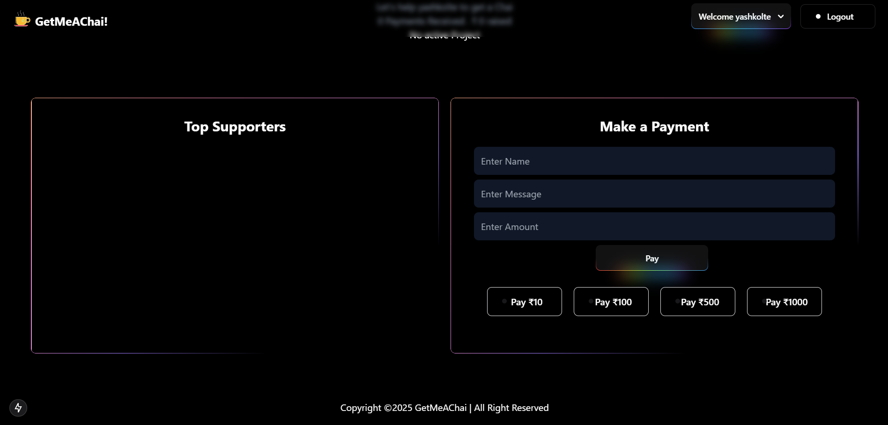

# Get Me A Chai

## Project Description
**Get Me A Chai** is a modern crowdfunding platform built with **Next.js (App Router)**, **React**, **MongoDB**, and **Node.js**. It empowers developers to raise funds for their projects while allowing supporters to contribute securely. With a Razorpay account, developers can seamlessly receive funds by setting up their client ID and secret.

The platform features a streamlined dashboard where developers can showcase their project name, description, and links. Supporters can explore projects and contribute, ensuring transparency and a user-friendly experience. Developers retain full control over refund policies, offering flexibility and trust.

---

## Tech Stack
- **Next.js** with **TailwindCSS** for a responsive and visually appealing UI.
- **MongoDB** for robust database management.

---

## Features

- **Intuitive Interface**: Designed for ease of use, enabling effortless navigation for both developers and supporters.
- **Secure Payments**: Razorpay integration ensures fast, secure, and reliable transactions.
- **Zero Platform Fees**: Completely free for both developers and supporters, making it accessible to everyone.
- **Data Security**: Robust security protocols to protect user data and transactions.
- **Flexible Fundraising**: Developers can run multiple campaigns simultaneously, enabling support for various projects.

---

## Screenshots

- 
- 
- 

---

## Environment Variables

To run the project locally, add the following environment variables to your `.env.local` file:

```env
NEXT_PUBLIC_URL=http://localhost:3000
MONGODB_URI=mongodb://localhost:27017/get-me-a-chai
NEXTAUTH_URL=http://localhost:3000
NEXTAUTH_SECRET=<your_secret>
GITHUB_ID=<your_github_id>
GITHUB_SECRET=<your_github_secret>
GOOGLE_ID=<your_google_id>
GOOGLE_SECRET=<your_google_secret>
```

---

## Installation

### Clone the Repository:
```bash
git clone https://github.com/Advanced-Boy-Shreyash/Get-Me-A-Chai.git
```

---

## Run Locally

1. **Install Dependencies:**
   ```bash
   npm install
   ```

2. **Set Up Razorpay:**
   - Create a Razorpay account and obtain your Razorpay ID and secret for testing.

3. **Configure Environment:**
   - Create a `.env.local` file in the project root as described above.

4. **Start the Development Server:**
   ```bash
   npm run dev
   ```

5. **Access the App:**
   - Open your browser and navigate to [http://localhost:3000](http://localhost:3000).

---

## Usage

### For Project Creators/Developers:
1. Sign up using Google or GitHub via NextAuth (credential login not supported).
2. After logging in, you'll be redirected to your dashboard.
3. Fill out the project name, description, link, Razorpay ID, and secret.
4. Save your details. If valid, you'll start receiving contributions directly into your Razorpay account.
5. Edit project details anytime from the dashboard, except for your email ID.

### For Fund Givers:
1. Visit the homepage and click on the **Fund Raisers** button.
2. Browse the top 10 fundraisers or use the search feature to find specific projects by name or developer.
3. Click on a project to view detailed information, including its name, description, and links.
4. To contribute, click **Pay**, fill in the required details, and proceed via Razorpay's secure payment gateway.
5. After a successful transaction, you'll receive a confirmation, and funds will go directly to the developer's Razorpay account.

---

Thank you for exploring **Get Me A Chai**! We hope this platform empowers developers and fosters innovation through community support.

